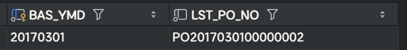

# 문서번호 처리 기술
채번 -> id나 문서번호를 부여하는것을 의미
## selete max 방식
- 구매오더 테이블의 채번 규칙
  - PO(고정문자) + YYYYMMDD(요청일자) + NNNNNNNN(순번8자리)
### select ~ max 
```sql
DECLARE
    V_NEW_PO_NO VARCHAR2(40);
    V_REQ_DT    DATE;
    V_REQ_YMD   VARCHAR2(8);
BEGIN
    V_REQ_DT := TO_DATE('20250211 23:59:59', 'YYYYMMDD HH24::MI:SS');
    V_REQ_YMD := TO_CHAR(V_REQ_DT, 'YYYYMMDD');

    SELECT 'PO' || V_REQ_YMD ||
           LPAD(
                   TO_CHAR(
                           TO_NUMBER(
                                   NVL(SUBSTR(
                                               MAX(T1.PO_NO), -8), '0')
                           ) + 1
                   ), 8, '0'
           )
    INTO
        V_NEW_PO_NO
    FROM T_PO T1
    WHERE T1.REQ_DT >= TO_DATE(V_REQ_YMD, 'YYYYMMDD')
      AND T1.REQ_DT < TO_DATE(V_REQ_YMD, 'YYYYMMDD') + 1;

    INSERT INTO T_PO(PO_NO, TIT, REQ_DT, REQ_UID)
    VALUES (V_NEW_PO_NO, 'TEST_' || V_NEW_PO_NO, V_REQ_DT, 'TEST');
    COMMIT;
END;
```
- t_po에서 요청이랒에 해당하는 가장 큰 po_no를 가져와 새로운 po_no를 채번하고 있음
  - po_no는 문자열이므로 채번을 하려면 숫자부분만 잘라서 처리해야함.
- 채번된 값은 V_NEW_PO_NO에 저장하고 있다 신규데이터를 insert함

> - 이러한 select max 방식은 혼자 테스트했을 경우는 문제 없음.
> - 동시에 여러명이 사용할 때를 고려해야함.
>   - 잠재적인 오류가 있을 수 있음.

## select max 방식의 성능
### req_dt를 이용한 select max
- 채번을 위한 맨 마지막 po_no 조회
```sql
select /*+ gather_plan_statistics */
    max(t1.po_no)
from T_PO t1
where t1.REQ_DT >= to_date('20170302', 'YYYYMMDD')
  and t1.REQ_DT < to_date('20170302', 'YYYYMMDD') + 1;
```
- req_dt에 대한 인덱스가 없기 때문에 full scan이 발생함

```sql
create index x_t_po_1 on T_PO(REQ_DT, PO_NO);
```
- max 처리하는 po_no와 req_dt를 복합 인덱스로 만든다.
- buffers가 8912에서 56으로 개선
- 그런 A_Rows가 10,000건으로, max 값을 구하기 위해 인덱스 리프 블록에서 만 건의 데이터에 접근함.

### index range scan(min/max)
- select max의 성능이 최적화되려면 실행계획에 index range scan(min/max)가 나와야함.
  - ` index range scan(min/max)` : 인덱스를 이용해 최댓값이나 최솟값을 빠르게 구하는 오퍼레이션
- ` index range scan(min/max)`은 제일 뒤에 있는 max(po_no)나 제일 앞에 있는 min(po_no)를 한 건만 읽음.
  - 이미 인덱스로 정렬이 돼있음.
- index range scan만 쓴다면 조건에 해당하는 리프 데이터를 모두 읽어야함.
- <u>복합 인덱스에서 선두 컬럼이 '범위 조건'이면, `index range scan(min/max)`를 사용할 수 없음 </u>
- <mark>'=' 조건일 경우에만 index range scan(min/max)를 사용할 수 있음'</mark>
  - req_dt는 date 타입이기 때문에 시분초까지 포함하고 같다(=) 조건으로 특정 하루의 모든 데이터를 조회할 수 없음
```sql
ALTER TABLE T_PO ADD REQ_YMD VARCHAR2(8);

update T_PO set REQ_YMD = to_char(REQ_DT, 'YYYYMMDD');

create index x_t_po_2 on T_PO(REQ_YMD, PO_NO);
```
- 테이블에 req_ymd를 넣어서 req_dt를 문자열로 관리
- 인덱스도 새로 생성
- `index range scan(min/max)`가 사용되어 a_rows가 10,000에서 1로 개선, Buffers도 56 -> 2로 개선됨.
> - max/min 집계함수가 사용된 sql의 실행계획에는 ` index range scan(min/max)`가 나오는 것이 좋음
> - 성능은 개선했지만, req_dt와 중복 속성인 req_ymd 컬럼을 추가한 것에 대해서는 고민할 필요가 있음.
>   - 같은 값을 중복해서 관리하는 것은 의외로 많은 문제가 있음.

### po_no를 이용한 select~max
- po_no는 'PO'라는 고정 문자열 다음 'YYYYMMDD'의 일자 + 8자리 순번으로 구성됨
```sql
select /*+ gather_plan_statistics */
    max(t1.po_no)
from T_PO t1
where t1.PO_NO >= 'PO' || '20170302'
  and t1.PO_NO < 'PO' || to_char(to_date('20170302', 'YYYYMMDD') + 1, 'YYYYMMDD');
```
- index range scan(min/max)가 적용
  - 복합인덱스 x
- like 조건은 min/max가 적용이 안됨.
- 위와 같이 크다 작다 조건을 동시에 사용해야함.

> 만약 채번 규칙에 요청 일자의 의미가 포함되지 않았다면 사용할 수 없음

### 정리
- select max 방식은 where 조건에 인덱스가 필수
- index range scan(min/max) 실행계획이 나와야함.

## select max 방식의 중복 오류
- 중복 오류가 발생할 가능성이 큼.
- 여러 명의 동시에 채번할 때만 발생
- 만약 한 세션에서 insert이후 커밋하지 않았다면, 다른 세션에서 이전 세션에서와 같은 채번을 할 가능성이 있음
  - 나중 세션은 대기상태에 빠지고 먼저 세션이 commit을 하면 중복 에러가 발생
- 중복 에러는 '다른 사용자가 같은 작업을 처리 중 입니다'와 같은 메세지를 보여주고 다시 시도하도록 하는 것이 좋음
- <u>매우 빈번하게 발생하는 채번은 select max 방식을 사용하지 않는 것이 좋음</u>

> - select max 방식은 별도의 객체(테이블, 시퀀스, 사용자함수)를 생성할 필요가 없어 편리함
> - 중복 오류 발생가능성 있음
> - 적절한 인덱스를 만들어 주지 못하면 성능에 이슈가 있음.


## 채번 테이블
- 중복 오류를 피하기 위해, 채번 테이블을 사용할 수 있음(100% 아님)
  - 중복 오류는 하루에 딱 한 번, 해당 일자의 최초 채번에만 발생할 수 있음. <- 여러 명이 동시에 요청할 때만

### 장점
- 채번 테이블의 기준일자가 pk이므로 추가 인덱스를 생성할 필요가 없음
- 일자별로 한 건의 데이터만 존재하므로, 단 한건의 데이터만 읽으면 채번할 수 있음
  - index range scan(min/max)를 고려할 필요가 없음
### 단점
- 중복 오류(최초에만 발생)
  - 해당 일자에 최초 채번이 동시에 실행될 경우
- 동시성 저하
  - 동시 채번이 발생하면 후행 채번은 선행 세션의 트랜잭션이 완료할 때까지 대기
- 관리 비용
  - 채번 테이블을 추가로 생성해서 관리해야 하는 관리의 부담이 존재

### 단점 해결
- 중복 오류
  - 다음날 채번 데이터를 미리 만들어 놓음.
  - 배치 작업을 통해 미리 등록해 놓거나, 오늘 첫 번째 채번이 이루어질 때ㅣ 내일의 0번째 채번 데이터를 같이 insert 하면 됨.
- 동시성 저하
  - 완벽하게 해결할 방법은 없음
  - 채번 과정을 독립된 트랜잭션으로 처리하는 방법이 있음
  - sequence 개체 사용 권장
- 관리비용
  - 모든 곳에 채번 테이블을 생성할 것이 아니라 어느 정도 통함된 구조의 채번 테이블을 만들어 해소 가능
  - 개발 인원이 주기적으로 변경되거나, 통합 테이블을 설계한 사람이 없다면 관리가 소홀해 질 수 있음.

## 채번 함수
- 오라클에 별도의 채번함수가 있는 것은 아님
- 채번 함수는 채번을 처리하는 사용자 정의 함수를 뜻 함.
  - PL/SQL을 이용해 개발자가 사용자가 직접 개발한 함수.
### autonomous transaction 옵션 지정 가능
- <u>함수를 호출한 메인 트랜잭션에 영향을 받지 않고 별도의 트랜잭션으로 처리됨.</u>
  - 채번과 메인 트랜잭션의 동시성을 모두 향상할 수 있음.
```sql
  IS PRAGMA AUTONOMOUS_TRANSACTION
```
- 채번 테이블과 채번함수를 만드러양 하는 관리 부담이 여전히 있음.
- 통합 채번 테이블을 만들 수 있지만, 핵심 업무는 별도의 채번 테이블과 함수를 사용하는 것이 좋음.

## 정리
- 트랜 잭션이 많이 발생하는 프로세스가 아니라면 select max 방법도 괜찮음
  - 인덱스를 만들어야함
- 초당 몇백 건의 데이터가 발생하는 트랜잭션이라면 시퀀스를 이용한 채번이 바람직.
  - 성능에 가장 유리
