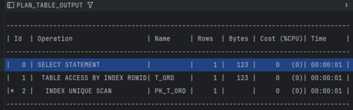
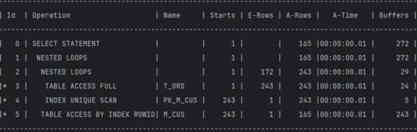

# 실행계획

- 작업 계획서
- sql 구문 분석 -> 실행계획 생성 -> 실행계획대로 실행
- 실행계획에 따라 성능이 달라지므로 sql 성능을 개선하려면 실행계획에 대한 이해가 필요하다

## 실행계획 확인

```sql
explain plan for ...

select * from table(dbms_xplan.display());
```

- **예상** 실행계획을 만들어 plan 테이블에 저장한다.
  
- id 항목 : 식별자, 실행되는 순서 x
  - 1번이 0번의 자식
    - <mark>자식 단계가 먼저 실행됨.</mark>
- Predicate Information
  - 실행계획의 각 단계에서 사용한 조건이나 연산정보를 준다.
  - 해당 단계를 어떤 조건으로 처리했는지에 따라 성능 차이 발생

### 각 항목

- id: 실행계획의 오퍼레이션 id
- operation: 해당 단계에 수행한 작업 내용
- name : 작업을 수행한 대상 오브젝트(테이블 또는 인덱스)
- rows: 해당 단계 수행 시 조회될 예상 데이터 건수
- bytes: 해당 단계까지 사용될 예상 데이터양 (누적)
- cost: 해당 단계까지 사용될 예상 비용(누적)
- time: 해당 단계까지 사용될 예상 시간(누적)

## 실행계획의 순서



- 자식이 부모보다 먼저 수행된다.
- 형제간에는 형(위에 있는 오퍼레이션)이 먼저 수행된다.
- 정확한 순서보다는 실행계획 트리를 통해 흐름을 파악하는 것이 중요.
  - 어느 오퍼레이션이 어느 오퍼레이션보다 먼저 수행되는지, 어떤 오퍼레이션이 수행되는지가 중요

## 실제 실행계획 확인하기

- /*+ gather_plan_statistics */ 힌트 추가

```sql
select
/*+ gather_plan_statistics */
    *
from ...


```

- 실제 실행계획을 만든 sql의 sql_id 찾기

```sql
select t1.sql_id, t1.child_number, t1.sql_text
from V$SQL t1
where t1.sql_text like '%gather_plan_statistics%'
order by t1.last_active_time desc;
```

- 실제 실행계획 조회하기(예상과 다를 수 있음)

```sql
select *
from table(dbms_xplan.display_cursor('<sqlId>',0,'ALLSTATS LAST'));
```


- `A-Rows, A-Times, Buffers` 항목의 수치가 눈에 띄게 높아진 단계가 있다면 원인을 찾아 성능 개선하면 됨.

  - A-Rows : 해당 단계의 실제 데이터 건수
  - A-Times: 해당 단계까지 수행된 실제 시간(누적)
    - 복잡한 실행계획이나 병렬 쿼리에서 부정확하게 나오는 경우가 있음.
  - Buffers : 해당 단계까지 메모리 버퍼에서 읽은 블록수(논리적 io 횟수, 누적)
- 실제 운용에서는 gather_plan_statistics 이 힌트를 넣으면 불필요한 수치 수집으로 성능상의 손해를 볼 수 있음.

## 옵티마이저

- sql을 실행하기 전에 실행계획을 만드는 역할
- 규칙 기반 옵티마이저 : 일정한 규칙에 따라 실행 계획을 만듦
- `비용 기반 옵티마이저` : sql을 처리하는 비용에 기반해 최소의 비용을 목표로 실행계획을 만듦.

  - 비용 : io의 횟수, cpu time, 메모리 사용량을 의미
  - **테이블의 통계 정보**가 필요
- 항상 최적화된 실행을 하는 것은 아니다.

  - `힌트`를 사용해 실행계획의 경로를 고정해주는 것도 고려할 필요가 있다.
  - sql -> 인덱스 -> 힌트(남발하면 안됨.)

## 소프트 파싱, 하드 파싱

- 소프트 파싱이 가능하도록 sql을 작성해야함.
  - 바인드 변수 사용

### 소프트 파싱

- 구문 분석만 하고 실행한 sql의 실행 계획이 있는지 메모리에 검색하고 있다면, 실행계획은 재사용함.

### 하드 파싱

- 구분 분석과 함께 실행계획까지 만드는 과정
- 제법 큰 비용이 소모됨.

```
## A 고객의 실행계획을 B 고객이 재사용했을 경우 성능이 나빠진 예
- 주문 테이블에 백 만건, A 고객은 한 건, B 고객은 십만 건의 주문이 있음
- B 고객의 주문 검색은 '고객 id 인덱스'를 사용하즞 것이 성능에 유리
- A 고객의 주문 검색은 '고객 id 인덱스'를 사용하면 성능에 좋지 않다.
  - 찾으려는 데이터가 많으면, 인덱스를 이용한 검색은 비효율적 일 수 있다.
- A 고객 주문을 먼저 조회 ->  '고객 id 인덱스' 실행계획이 만들어 짐.(빠르게 처리 됨)
- B 고객의 주문을 조회 -> '고객 id 인덱스' 실행계획 재사용( 오래 걱릴 수 있다.)
```

- 그럼에도 불구하고 소프트 파싱으로 개발 -> 하드 파싱은 생각보다 많은 cpu 자원을 사용함.

## IO

- 성능 개선의 핵심
- 불필요한 io가 발생하지 않는지 살펴봐야 한다.
  - 불필요한 테이블을 사용하고 있는지 확인 -> 불필요한 데이터를 조회하지 않는지 확인 -> 인덱스 사용
- <mark>최소의 io로 처리하려면 인덱스가 필수지만, 찾으려는 데이터가 너무 많으면 인덱스는 오히려 독이 될 수 있다.</mark>

## block

- io를 처리하는 최소 단위(page)
- 데이터 한 건을 조회하거나 저장하기 위해서는 하나의 블록을 읽거나 써야 한다.
  - 대부분 OLTP 시스템은 8kb 크기의 블록을 사용한다.
- 한 블럭에 여러 건의 데이터가 들어갈 수도 있고, 한 건의 데이터가 모두 들어가지 못할 수도 있다.
- io를 최적화하려면 <mark>하나의 블록에 많은 데이터가 들어가도록 테이블을 설계할 필요가 있다</mark>.


## 논리적 io와 물리적 io

- `Buffers는` 논리적 io
  - 오라클 메모리 영역인 버퍼캐시에서 데이터를 읽었음을 뜻함.
  - sql을 처리할 때 필요한 데이터가 버퍼캐시에 있는지 먼저 확인함.
  - 필요한 데이터가 버퍼캐시에 모두 있다면, 논리적 io만으로 sql을 처리할 수 있음.
- `Reads는` 물리적 io
  - 버퍼캐시에 원하는 데이터가 없으면, 디스크까지 가서 데이터 블록을 가져와야 함.
  - 물리적인 디스크에서 데이터를 읽었음을 뜻함.
  - 한 번 사용한 블록은 다시 사용할 가능성이 크므로 버퍼캐시에도 저장해 놓음.
- 버퍼캐시가 꽉 차 있다면, 가장 오래전 사용된 데이터를 제거함.
- 메모리 크기를 늘려 버퍼캐시를 크게 설정한다고 성능이 선형적으로 좋아지는 것은 아님.
  - 적절한 sql과 인덱스가 선행되야함.
- 위 두개는 **_누적된 값_**임.

## 부분 범위 처리
- 조건에 맞는 데이터를 필요한 만큼만 찾아서 먼재 내보내는 처리 방식
  - 화면에 50건을 먼저 보여줘야 한다면, 50건만 우선 전송함.
  - 사용자가 다음 데이터를 요청해야만 다음 50r건을 전송함.
- 사용자에게 빠른 응답시간을 보장해줌.
- 성능이 최적화된 부분 범위 처리는 결과를 내보내는 과정뿐 아니라 **_데이터를 읽는 과정_**도 부분 범위 처리돼야 함.
  - 모든 sql을 그렇게 할 수 있는 것은 아님
  - orderby, group by, sum 등 집계함수가 사용된 sql은 데이터를 찾는 과정을 부분 범위 처리하기 쉽지 않음.
    - 정렬, 그룹화된 결과 집합을 얻으려면 전체 데이터를 읽어야 함.
