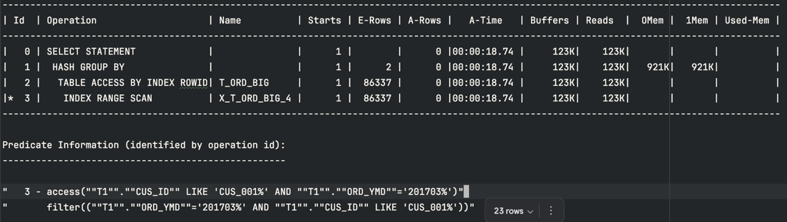

<!-- TOC -->
* [index](#index)
  * [최적의 인덱스를 만들려면..](#최적의-인덱스를-만들려면)
    * [인덱스 전](#인덱스-전)
    * [인덱스 후](#인덱스-후)
  * [인덱스 종류](#인덱스-종류)
    * [단일 인덱스](#단일-인덱스)
    * [복합 인덱스](#복합-인덱스)
    * [유니크 인덱스](#유니크-인덱스)
    * [비유니크 인덱스](#비유니크-인덱스)
    * [b트리 인덱스](#b트리-인덱스)
    * [비트맴 인덱스](#비트맴-인덱스)
    * [IOT(Index Organized Table)](#iotindex-organized-table)
    * [파티션](#파티션)
  * [B* 트리](#b-트리)
  * [인덱스 블록](#인덱스-블록)
    * [루트 블록](#루트-블록)
    * [브랜치 블록](#브랜치-블록)
    * [리프 노드](#리프-노드)
  * [데이터를 찾는 방법](#데이터를-찾는-방법)
    * [테이블 전체 읽기(table access full, 풀 스캔)](#테이블-전체-읽기table-access-full-풀-스캔)
    * [인덱스를 이용한 찾기(index range scan & table access by index rowid)](#인덱스를-이용한-찾기index-range-scan--table-access-by-index-rowid)
      * [(1) 루트에서 리프로](#1-루트에서-리프로)
      * [(2) 리프 블록 스탠(range scan)](#2-리프-블록-스탠range-scan)
      * [(3)테이블 접근(table access by index rowid)](#3테이블-접근table-access-by-index-rowid)
  * [인덱스 vs 풀스캔](#인덱스-vs-풀스캔)
    * [랜덤 액세스(random access)](#랜덤-액세스random-access)
  * [단일 인덱스](#단일-인덱스-1)
    * [단일 인덱스 컬럼 정하기](#단일-인덱스-컬럼-정하기)
      * [선택성이 좋은 컬럼](#선택성이-좋은-컬럼)
      * [선택성이 안 좋은 컬럼](#선택성이-안-좋은-컬럼)
    * [단일 인덱스 vs 복합 인덱스](#단일-인덱스-vs-복합-인덱스)
  * [복합 인덱스](#복합-인덱스-1)
    * [컬럼 선정과 순서 1](#컬럼-선정과-순서-1)
      * [컬럼 순서에 따라 Buffers가 차이나는 이유](#컬럼-순서에-따라-buffers가-차이나는-이유)
    * [컬럼 선정과 순서 2](#컬럼-선정과-순서-2)
      * [위의 sql에서 X_T_ORD_BIG_3과 X_T_ORD_BIG_4차이](#위의-sql에서-x_t_ord_big_3과-x_t_ord_big_4차이)
    * [컬럼 선정과 순서 3](#컬럼-선정과-순서-3)
    * [컬럼 선정과 순서 4](#컬럼-선정과-순서-4)
    * [정리](#정리)
  * [인덱스의 활용](#인덱스의-활용)
    * [인덱스로 커버된 sql](#인덱스로-커버된-sql)
    * [Predicate Information - ACCESS](#predicate-information---access)
    * [너무 많은 인덱스의 위험성](#너무-많은-인덱스의-위험성)
<!-- TOC -->
# index

- `조건에 맞는` 테이블 내의 데이터를 찾을 수 있게 일부 데이터를 모아서 구성한 데이터 구조
- 인덱스를 이용하면 테이블 내의 데이터를 빠르게 찾아낼 수 있음.

## 최적의 인덱스를 만들려면..

- 인덱스의 물리적인 구조를 이해해야
- 복잡한 sql을 분해해서 이해할 수 있는 능력
- 만들어진 인덱스가 어떻게 사용될지 예측할 수 있는 능력
- 테이블 내의 데이터 속성을 파악할 수 있는 능력
- join의 내부적인 처리방법(nested, loops, merge, hash)의 이해

### 인덱스 전

- full scan으로 약 4초
  

### 인덱스 후

- 0.1초로 단축
- buffers 258k -> 24로 단축
  

## 인덱스 종류

### 단일 인덱스

- 인덱스에 하나의 컬럼만 사용
  - 고객id, 주문번호 등등 단일 컬럼일 경우

### 복합 인덱스

- 인덱스에 두 개 이상의 컬럼을 사용
- 복합 인덱스로 여러 sql을 커버하는 것이 좋음.
  - sql 별로 필요한 인덱스를 모두 만들다 보면 인덱스가 너무 많아짐.

### 유니크 인덱스

- 인덱스 구성 컬럼들 값에 중복을 허용하지 않음.
  - pk 제약 조건 등 업무적으로 유니크한 속성들을 파악해서 유니크 인덱스를 만들어 주는 것이 좋음

### 비유니크 인덱스

- 인덱스 구성 컬럼들 값에 중복을 허용함

  -------------------------------------

### b트리 인덱스

- 트리형 자료구조를 사용

### 비트맴 인덱스

- 값의 종류가 많지 않은 컬럼에서 사용
- 주문 유형의 값이 '주문대기', '주문완료' 두 가지만 있다면 고려 가능.
- b트리 인덱스가 성능 면에서 유리할 때가 많음.

### IOT(Index Organized Table)

- 테이블 자체를 특정 컬럼 기준으로 인덱스화 하는 개념
- 클러스터드 인덱스와 같은 개념
  - mysql은 pk를 무조건 클러스터드 인덱스로 구성
  - 오라클은 잘 사용안함
- b트리로 구성

### 파티션

- 대용량 테이블에는 파티션을 구성하는 것이 좋음
- 파티션 없이 인덱스를 만들어 사용하기에는 성능에 한계가 있음
- 오래된 데이터는 별도 저장소로 백업한 후 주기적으로 지우는 것이 비용과 성능에 도움이 된다.
  이때, 파티션이 매우 유용
- 파티션 테이블에는 파티션 된 인덱스를 만들 수 있음
  - 글로벌 인덱스
  - 로컬 인덱스

> 분류를 혼합해서 인덱스를 생성 할 수 있다.
>
> - 복합 인덱스 면서 유니크인 b트리 인덱스
> - 단일 인덱스면서 비트맵 형태 인덱스 등등

## B* 트리

- 균형이 잡혀 있고 근접한 리프 노드가 연결된 구조
- `B` : balanced 의미 -> 리프 노드들이 같은 수준에 자리해 있다는 의미
- `*` : 근접한 리프 노드가 연결된 구조를 의미

## 인덱스 블록

- 루트
  - 최상위에 단 하나만 존재
  - 하위 브랜치 블록의 인덱스 키 값과 주소를 가지고 있음.
- 브랜치
  - 루트와 리프의 중간 위치, 브랜치는 여러 층이 있을 수 있음.
- 리프
  - 최하위에만 위치
  - `인덱스 키 값(인덱스를 구성하는 컬럼)`과 데이터의 로우 위치(ROWID)를 가지고 있음.
  - 리프 블록은 인덱스 키 값 순으로 정렬
    

### 루트 블록


- `20170104`를 찾아야함
- 세 개의 브랜치 블록(B05, B06, B01)을 찾아갈 수 있음.
- `20170104`는 빈값보다 크고 20170601보다 작음 -> B05로 이동

### 브랜치 블록


- 세 개의 리프블록을 가지고 있음
- `20170104`는 20170102보다 크고  20170104보다 작거나 같으므로 -> `B10으로` 이동
- B21로의 이동은 B10 뒷부분에도 `20170104`가 있을 수 있으므로 가서는 안됨.

### 리프 노드


- B10 마지막 부분에 `20170104`가 있음 <- B21로 이동했다면 rid_23에 있는 데이터는 찾지 못함
- 인덱스를 검색해서 리프 블록에 도달하면 리프 블록을 차례대로 스캔
  - 찾으려는 값보다 큰 값을 발견하기 전까지 수행
  - B10 첫 번째 데이터에서 시작해 B21 블록의 20170105를 만날 때 까지 스캔 진행
- ROWID를 참고해 실제 테이블 접근 작업을 수행

## 데이터를 찾는 방법

### 테이블 전체 읽기(table access full, 풀 스캔)

- 테이블의 데이터 블록을 차례대로 모두 읽으면서 필요한 데이터를 찾는 방법
- 인덱스가 없거나 인덱스보다 테이블 전체를 읽는 것이 효율적일 경우 사용
- 오라클에서 데이터가 테이블에 저장될 때는 특정 순서를 갖는다고 장담할 수 없음
- 데이터가 `백만 건` 정도 된다면 인덱스를 사용하는 것 보다 풀 스캔이 효율적일 수 있다.
  

### 인덱스를 이용한 찾기(index range scan & table access by index rowid)

- 인덱스를 이용해 필요한 데이터만 찾는 방법
- 필요에 따라 table access by index rowid를 동반한다.

```
1. 루트에서 리프로 : 검색 조건에 해당하는 첫 번재 리프 블록을 찾는 과정
2. 리프 블록 스캔: 찾아낸 지점부터 리프 블록을 차례대로 읽어 가는 과정
=> `1 + 2 index range scan이라 함`
3. 테이블 접근: 리프 블록을 스캔하면서 필요에 따라 테이블에 접근하는 과정
=> `table access by index rowid라 함.`
```

#### (1) 루트에서 리프로

- 매우 빠르게 이루어짐

#### (2) 리프 블록 스탠(range scan)

- <mark>인덱스의 키 컬럼이 차례대로 정렬돼 있음</mark>
- 해당 데이터보다 큰 값을 만날때 까지 스캔
  

#### (3)테이블 접근(table access by index rowid)

- 리프 블록의 rouwid 값을 참조해 테이블의 데이터를 찾아가는 과정
- 테이블에서 필요한 값이 있을 때만 일어난다.
  - cus_id가 인덱스가 지정돼 있지 않다면 `table access by index rowid` 작업을 수행

```sql
create index x_t_ord_big_1 on t_ord_big(ord_ymd);
  
select /*+ gather_plan_statistics */
    t1.CUS_ID, count(*) ord_cnt
from t_ord_big t1
where t1.ORD_YMD = '20170316'
group by t1.CUS_ID
order by t1.CUS_ID;
```

## 인덱스 vs 풀스캔

### 랜덤 액세스(random access)

- io 작업 한 번에 하나의 블록을 가져오는 접근 방법
- 인덱스 리프 블록에서 rowid를 통해 테이블에 접근할 때 랜덤 액세스 발생
- 실행 계획에는 table access by index rowid로 표시
- 찾으려는 데이터가 많지 않으면 효율 좋음 그렇지 않으면 비효율

```sql
select /*+ gather_plan_statistics */
    t1.CUS_ID, count(*) ord_cnt
from t_ord_big t1
where t1.ORD_YMD = '20170316'
group by t1.CUS_ID
order by t1.CUS_ID;
```

- 위 sql은 총 3천만 건의 데이터 중, 5 만건의 데이터가 있음
  - 여기서 인덱스는 효율적임
  - 데이터 건 수가 아닌 `블록 수로 판단해야함.`

```sql
-- 약 7백만 건의 달하는 대량 데이터임.
-- 인덱스 사용
select /*+ gather_plan_statistics index(t1 x_t_ord_big_1) */
    t1.ord_st, sum(t1.ord_amt)
from t_ord_big t1
where t1.ORD_YMD between '20170401' and '20170630'
group by t1.ord_st;

select t1.SQL_ID, t1.CHILD_NUMBER, t1.SQL_TEXT
from V$SQL t1
where t1.SQL_TEXT like '%gather_plan_statistics%'
order by t1.LAST_ACTIVE_TIME;

```


- table access by index rowid가 7,650k 번 실행 됨
  - 바로 전 단계인 index range scan의 a-rows 수 많큼 실행됨
    => 매우 많은 랜덤 액세스가 발생.


- 인덱스로 처리할 때보다 속도가 빨라짐
- Buffers 수치도 낮아짐
- <mark>찾고자 하는 데이터가 특정 수준 이상으로 많으면 인덱스를 이용한 랜덤 액세스보다 full scan 방식이 효율적</mark>
  - 하지만, 테이블에 데이터가 계속 쌓이는 구조라면 full scan 방식은 시간이 지날 수록 성능이 나빠진다.
  - 이런경우, 데이터를 잘라내거나 파티션 전략을 수립할 필요가 있다.

```
- 상대적으로 적은 양의 데이터를 읽는다면 인덱스가 유리하다.
- 많은 양의 데이터를 읽어야 한다면 full scan이 유리할 수 있다.
- full scan은 데이터가 쌓일수록 성능이 점차 나빠진다. 테이블 전략이 필요하다.
```

## 단일 인덱스

### 단일 인덱스 컬럼 정하기

- 조건에 맞는 데이터를 빠르게 찾기 위해 인덱스를 사용
- where 조건절에 사용된 컬럼에 인덱스를 구성하는 것이 기본 원리

```sql
-- - 인덱스없이 5초 정도 소요됨.
select /*+ gather_plan_statistics */
  to_char(t1.ord_dt, 'YYYYMM'),
  count(*)
from T_ORD_BIG t1
where t1.CUS_ID = 'CUS_0064'
  and t1.PAY_TP = 'BANK'
  and t1.RNO = 2
group by to_char(t1.ord_dt, 'YYYYMM');
```

- 효율적인 단일 인덱스 찾기
  - 위의 sql에서 인덱스 후보들은 cus_id, pay_tp, rno 3개임

```sql
-- 컬럼 별 조건에 따른 결과 건수
select 'CUS_ID' col, count(*) cnt from T_ORD_BIG t1 where t1.CUS_ID  = 'CUS_0064'
union all
select 'PAY_TP' col, count(*) cnt from T_ORD_BIG t1 where t1.PAY_TP = 'BANK'
union all
select 'RNO' col, count(*) cnt from T_ORD_BIG t1 where t1.RNO = 2;

-- cus_id -> 340,000
-- pay_tp -> 9,150,000
-- rno -> 3,047
```

- 선택성이 좋은 컬럼을 사용하는 것이 좋음.
  - 조건에 해당하는 데이터가 `적을수록 선택성이 좋고`, 많을수록 안 좋음
- 따라서, 단일 인덱스를 생성해야 한다면, `rno를` 선택하는 것이 좋음.

#### 선택성이 좋은 컬럼

```sql
create index x_t_ord_big_2 on T_ORD_BIG(rno);


select /*+ gather_plan_statistics index(t1 x_t_ord_big_2)*/
    to_char(t1.ord_dt, 'YYYYMM'),
    count(*)
from T_ORD_BIG t1
where t1.CUS_ID = 'CUS_0064'
  and t1.PAY_TP = 'BANK'
  and t1.RNO = 2
group by to_char(t1.ord_dt, 'YYYYMM');


select t1.SQL_ID, t1.CHILD_NUMBER, t1.SQL_TEXT
from V$SQL t1
where t1.SQL_TEXT like '%gather_plan_statistics%'
order by t1.LAST_ACTIVE_TIME;

select *
from table (DBMS_XPLAN.DISPLAY_CURSOR('d69uxzw80puar', 0, 'ALLSTATS LAST'));
```


- 인덱스를 이용해 3047건의 데이터를 찾고, 이 데이터를 랜덤 액세스함.

#### 선택성이 안 좋은 컬럼

```sql
create index x_t_ord_big_3 on T_ORD_BIG (CUS_ID);

select /*+ gather_plan_statistics index(t1 x_t_ord_big_2)*/
    to_char(t1.ord_dt, 'YYYYMM'),
    count(*)
from T_ORD_BIG t1
where t1.CUS_ID = 'CUS_0064'
  and t1.PAY_TP = 'BANK'
  and t1.RNO = 2
group by to_char(t1.ord_dt, 'YYYYMM');


select t1.SQL_ID, t1.CHILD_NUMBER, t1.SQL_TEXT
from V$SQL t1
where t1.SQL_TEXT like '%gather_plan_statistics%'
order by t1.LAST_ACTIVE_TIME;
```


- rno를 사용하는 것보다 오래 걸림.
  - index range scan 단계에서 340K의 A-ROW가 나오고 이 갯수를 모두 랜덤 액세스.
  - Buffers도 245k에 달함.

### 단일 인덱스 vs 복합 인덱스

- 복합 인덱스는 두 개 이상의 컬럼으로 구성된 인덱스
- 하나의 복합 인덱스로 여러 개의 인덱스를 대신 할 수 있는 장점이 있음.
  - 인덱스가 많아질수록 입력, 수정, 삭제에서는 성능 감소가 발생함.
  - 데이터 변경이 발생할 때 마다 인덱스 역시 변경을 해주어야 함.
- 따라서, 복합 인덱스로 인덱스 수를 줄이는 것은 중요함.

```sql
-- ord_ymd 인덱스 사용
select /*+ gather_plan_statistics index(t1 x_t_ord_big1) */
    t1.ord_st,
    count(*)
from T_ORD_BIG t1
where t1.ORD_YMD like '201703%'
and t1.CUS_ID = 'CUS_0075'
group by t1.ord_st;
```


- 단일 인덱스를 사용할 경우 1,850k건의 orm_ymd 데이터와 cus_id 값을 찾기위해 테이블에 액세스해야 함.

```sql
-- 복합인덱스 적용(컬럼 순서는 신경쓰지 않음)
create index x_t_ord_big_3 on T_ORD_BIG(ORD_YMD, CUS_ID);

select /*+ gather_plan_statistics index(t1 x_t_ord_big3) */
  t1.ord_st,
  count(*)
from T_ORD_BIG t1
where t1.ORD_YMD like '201703%'
  and t1.CUS_ID = 'CUS_0075'
group by t1.ord_st;
```


- A-ROWS의 횟수가 3,000에 불과함.
  - 인덱스에 조건 컬럼의 정보가 모두 있음.
  - 테이블에 접근하지 않아도 조건에 맞는 데이터를 찾을 수 있음.
  - 다만, ord_st 컬럼은 인덱스에 없으므로 테이블 접근은 피할 수 없음.
- <mark>랜덤 액세스가 백만 번 이상 발생한다면 좋은 성능을 기대하기 어려움.</mark>


- 단일 인덱스는 ord_ymd조건은 인덱스를 통해 해결했지만, cus_id는 테이블에 접근해야함
- 복합 인덱스는 두 조건 모두 인덱스에서 해결 가능

  - ord_ymd별로 데이터가 정렬 -> cus_id 순으로 정렬
- 복합 인덱스를 너무 많이 사용하면 삽입,삭제,수정시 성능 저하가 나타난다.

> ```
> alter system flush buffer_cache;
> ```
> 버퍼캐시를 지울 수 있음 -> 운영환경에서 사용하면 절대 안됨.


## 복합 인덱스
### 컬럼 선정과 순서 1
- 가장 중요한 것은 인덱스를 구성하는` 컬럼 순서`.
- `'='조건`이 사용된 컬럼을 복합 인덱스의 `앞 부분`에 두는 것이 기본 원칙
```sql
create index x_t_ord_big_4 on T_ORD_BIG (CUS_ID, ORD_YMD); -- 컬럼 순서 변경

select /*+ gather_plan_statistics index(t1 x_t_ord_big_4) */
  t1.ord_st,
  count(*)
from T_ORD_BIG t1
where t1.ORD_YMD like '201703%'
  and t1.CUS_ID = 'CUS_0075'
group by t1.ord_st;
```
- Buffers 항목 125로 개선됨.
- 컬럼 순서를 변경하여 7000 블록 정도의 io 개선

#### 컬럼 순서에 따라 Buffers가 차이나는 이유

- index range scan에서 가장 먼저 할 일은 루트에서 검색을 시작할 리프노드를 찾아가는 것임.
- x_t_ord_big_3
  - 선두 컬럼이 like 조건절을 사용.
    - 인덱스의 두 번째 컬럼은 리프 검색의 시작 위치를 찾아내는데 관여하지 못함.
    - cus_id도 흩어져 있어  불필요한 cus_id도 읽는 비효율이 발생
-  x_t_ord_big_4
  - 선두 컬럼이 = 조건으로 사용되어야만 두 번째 컬럼도 리프 블록의 검색 시작 위치를 찾는데 관여할 수 있음.

> 무조건 맞는 공식은 아님, 범위 조건 컬럼을 인덱스의 선두로 놓는 것이 좋은 경우도 있음.</br>
> 조인이 포함되면 조인 조건까지 생각해 인덱스의 컬럼 순서를 결정해야함.

### 컬럼 선정과 순서 2
- 하나의 복합 인덱스가 특정 sql에 매우 효율적일 수 있지만, 다른 sql에는 매우 비효율적일 수 있음.
```sql
select 
    t1.ord_st,
    count(*)
from T_ORD_BIG t1
where t1.ORD_YMD = '201703%'
  and t1.CUS_ID like 'CUS_001%'
group by t1.ord_st;
```
#### 위의 sql에서 X_T_ORD_BIG_3과 X_T_ORD_BIG_4차이



### 컬럼 선정과 순서 3
- 3개 조건이 사용된 sql 복합 인덱스
- = 조건이 사용된 컬럼을 선두로 사용하면 됨.
```sql
select t1.ORD_ST, count(*)
from T_ORD_BIG t1
where t1.ORD_YMD like '201704%'
  and t1.CUS_ID = 'CUS_0042'
  and t1.PAY_TP = 'BANK'
group by t1.ORD_ST;
```
- 만약 아래와 같은 sql이 있다면 cus_id와 pay_tp 중 cus_id를 인덱스 선두에 놓는 것이 좋음
```sql
select 'x'
from dual A
where exists(select *
             from T_ORD_BIG t1
             where t1.CUS_ID = 'CUS_0042');

```
- exist sql의 성능도 확보 가능.
- 한 개의 인덱스로 여러 sql을 커버하는 것이 가장 중요.

### 컬럼 선정과 순서 4
- 많은 조건이 있는 sql의 경우 <u>성능 향상에 도움이 되는 조건 컬러만 선별해서</u> 인덱스를 만들 필요가 있음
```sql
select count(*)
from T_ORD_BIG t1
where t1.ORD_AMT = 2400
  and t1.PAY_TP = 'CARD'
  and t1.ORD_YMD = '20170406'
  and t1.ORD_ST = 'COMP'
  and t1.CUS_ID = 'CUS_0036';

select  'ord_amt' col, count(*) from T_ORD_BIG t1 where t1.ORD_AMT = 2400
union all
select  'pay_tp' col, count(*) from T_ORD_BIG t1 where t1.PAY_TP= 'CARD'
union all
select  'ORD_YMD' col, count(*) from T_ORD_BIG t1 where t1.ORD_YMD = '20170406'
union all
select  'ORD_ST' col, count(*) from T_ORD_BIG t1 where  t1.ORD_ST = 'COMP'
union all
select  'CUS_ID' col, count(*) from T_ORD_BIG t1 where  t1.CUS_ID = 'CUS_0036'
```


- cus_id와 ord_ym컬럼으로 복합인덱스를 구성하면 좋음.
- 실제로, 이미 생성되있는 X_T_ORD_BIG_3 인덱스를 사용함.

### 정리
- `=조건`이 사용된 컬림이 복합 인덱스의 앞부분에 위치해야 함.
- 인덱스를 만들 때, 테이블에 대한 sql 전체를 검토하도록 함(가능하면 많은 sql)
- 조건에 사용된 모든 컬럼을 무조건 복합 인덱스에 추가해서는 안 됨.
  - 성능에 도움 되는 조건 컬럼만 선별해서 복합 인덱스를 구성해야함.
- 무조건적인 것은 아님
- 때에 따라서는 복합 인덱스를 굳이 만들 필요 없을 수 있음
- 하나의 sql을 위한 인덱스는 큰 의미 없음.

## 인덱스의 활용
### 인덱스로 커버된 sql
- 테이블 접근 없이 인덱스 만으로 sql이 처리되는 것.
- 인덱스를 이용해 데이터를 검색할 경우, 테이블 접근 횟수를 줄이는 것이 매우 중요.
```sql
select /*+ gather_plan_statistics index(t1 x_t_ord_big_4) */
    t1.ord_st,
    count(*)
from T_ORD_BIG t1
where t1.ORD_YMD = '201703%'
  and t1.CUS_ID like 'CUS_001%'
group by t1.ord_st;
```
- 위의 sql에서 table access by index rowid 에서 Buffers가 30000개로 증가.
  - ord_st 컬럼은 인덱스에 없기 때문 
  - 이것을 없앤다면 sql 성능을 끌어올릴 수 있음.
```sql
DROP index x_t_ord_big_4;
create index x_t_ord_big_4 on T_ORD_BIG(CUS_ID, ORD_YMD, ORD_ST);
```

- table access by index rowid 작업이 생략됨
- 테이블 접근 없이 인덱스 만으로 sql이 처리됨.
- 모든 sql에 인덱스를 생성하면 안됨
  - 데이터 변경 시 성능이 나빠짐
  - 요구사항은 수시로 변경됨.
- 사실상 최후의 순간에만 사용해야.

### Predicate Information - ACCESS
- 인덱스를 제대로 탔는지 확인해야 함.
```sql
select /*+ gather_plan_statistics */
  t1.ord_st,
  count(*)
from T_ORD_BIG t1
where substr(t1.ORD_YMD,1,6) = '201703%'
  and t1.CUS_ID = 'CUS_0075'
group by t1.ord_st;
```

- X_T_ORD_BIG_4 인덱스가 적용됨
- Predicate Information을 보면,
  - cus_id를 access로 substr(t1.ORD_YMD,1,6)를 filter로 처리함.
- `access`는 인덱스 리프 블록의 스캔 시작 위치를 찾는데 사용.
- `filter`는 리프 플록을 차례대로 스캔하면서 처리한 조건.</br>
=> 즉, 리프 블록의 검색 시작 위치를 찾을 때, cus_id 조건만 사용됨.
=> 제대로 인덱스를 탔다면, ord_ymd도 access에 표시됐어야함.

> 인덱스에는 substr 적용 이전의 원래 값만 저장되어 있으므로, 인덱스로 구성한 컬럼을 변형해 조건절에서 사용하면 인덱스를 사용할 수 없음


```sql
select /*+ gather_plan_statistics */
  t1.ord_st,
  count(*)
from T_ORD_BIG t1
where t1.ord_ymd like '201703%'
  and t1.CUS_ID = 'CUS_0075'
group by t1.ord_st;
```


- cus_id와 ord_ymd를 동시에 access하여 인덱스를 제대로 탐
- filter가 한 번 더나오지만 이미 access했으므로 크게 중요하지 않음.

### 너무 많은 인덱스의 위험성
- 인덱스가 많아지거나 인덱스를 구성하는 컬럼이 너무 많아지는 것은 항상 경계해야함.
```sql
select t1.SEGMENT_NAME,
       t1.SEGMENT_TYPE,
       t1.BYTES / 1024 / 1024 as size_mb,
       round(t1.BYTES / t2.cnt, 1) byte_per_row
from DBA_SEGMENTS t1,
     (select count(*) cnt from ORA_SQL_TEST.T_ORD_BIG) t2
where t1.SEGMENT_NAME like '%ORD_BIG%'
order by t1.SEGMENT_NAME;
```

- 인덱스 들의 크기를 합치면 테이블보다 훨씬큼.
- 데이터 한 건이 insert될 때마다, 테이블과 인덱스에 insert가 발생
  - 인덱스는 리프 블록이 정렬되어야 하므로 꼭 정해진 위치에 데이터가 insert되야 하기 때문에 부담이 큼.

