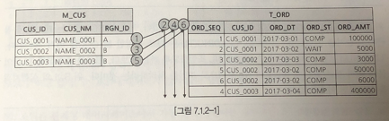
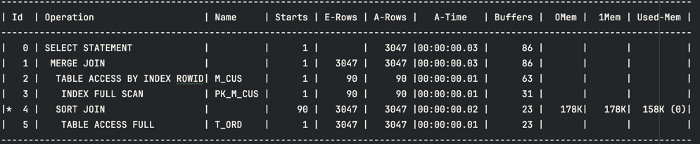
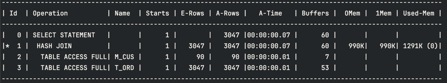
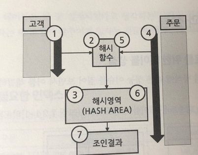

# join과 성능
## 조인의 내부적인 처리 방식
- 어떤 조인 처리 방식을 사용하든 조인 결과에 영향을 주지 않음.
- 카테시안 조인은 hash join 방식이 불가능.
## NL 조인(NESTED LOOPS JOIN)
- 중첩된 반복문 형태로 데이터를 연결하는 방식

- m_cus 테이블을 읽는 것은 바깥쪽 루프
  - 조인을 위해 먼조 접근하는 쪽을 `선행 집합`
- t_ord를 읽는 과정은 안쪽 루프
  - 뒤에 접근하는 쪽을 `후행 집합` 
```sql
select /*+ gather_plan_statistics LEADING(t1) USE_NL(t2) */
    t1.RGN_ID,
    t1.CUS_ID,
    t1.CUS_NM,
    t2.ORD_DT,
    t2.ORD_ST,
    t2.ORD_AMT
from M_CUS t1,
     T_ORD t2
where t1.CUS_ID = t2.CUS_ID;
```
- `LEADING`은 선행 집합을 지정, `USER_NL은` NL조인 하도록 함.

- nested loops의 자식 단계의 2,3번 단계를 nl 조인 처리함
  - 형제일 경우 위에서 부터 수행
- `Starts`는 nl 조인에서 후행 집합에 접근한 횟수.
  - 선행 집합의 건수만큼 후행 집합을 반복 접근
    - count로 계산해 <u>선행 집합의 크기가 작은것을 선택해야함</u>
  - t_ord에 총 90번의 접근을 해야하지만, 부분 범위 처리때문에 15번만 함.
    - 끝까지 스크롤 내리면 90번 접근
- 3번 단계에서 90번이나 데이터를 **_풀 스캔_**하는 것은 성능에 문제가 있을 수 있음.
> - 데이터 베이스에서 가장 많이 사용하는 내부적인 조인 처리 방식</br>
>
> - 필요한 부분에 인덱스를 정확히 만들어 준다면, 가장 적은 비용으로 빠르게 조인결과를 얻을 수 있음 </br>
> - 대량 데이터를 조인하기에는 한계가 있음.

## MERGE JOIN
- 두 데이터 집합을 `연결 조건 값`으로 정렬한 후 조인을 처리하는 방식
- _**정렬된 데이터_**를 차례대로 읽어가면서 조인을 수행
- 연결 조건 기준으로 정렬되어 있어야만 조인이 가능하므로 소트 머지 조인, 소트 조인이라 부름
```sql
select /*+ gather_plan_statistics LEADING(t1) USE_MERGE(t2)  */
    t1.RGN_ID,
    t1.CUS_ID,
    t1.CUS_NM,
    t2.ORD_DT,
    t2.ORD_ST,
    t2.ORD_AMT
from M_CUS t1,
     T_ORD t2
where t1.CUS_ID = t2.CUS_ID;
```

- `SORT JOIN`은 자신의 자식 단계의 결과를 조인을 위해 정렬하는 작업.
  - 조인 조건 컬럼인 cus_id를 기준으로 정렬한다.
- m_cus대한 sort 작업이 존재하지 않음
  - 3번 단계에서 pk_m_cus를 `index full scan`함
    - 인덱스 리프 블록을 처음부터 끝까지 차례대로 읽는 작업
  - 인덱스 리프 블록은 인덱스 키 값으로 정렬돼 있음.
  - 즉, pk_m_cus를 `index full scan`하면, cus_id를 정렬한 것과 같음.
- `Used-Mem`: 실제 사용한 메모리
- `OMem(optional)`, `1Mem(one pass)`가 잇으면 sort가 있었다고 생각하면 됨.
- `USED-TEMP`가 있다면 temp 영역을 사용한 것이므로 메우 고비용.
</br>
</br>

- 위 그림은 인덱스는 없다고 가정
- nl조인은 고객 테이블의 데이터 검수만큼 주문 테이블을 반복 접근하지만, 머지 조인은 주문 테이블을 반복해서 접근할 필요가 없음.
- 단, 머지 조인은 정렬해야함.

## HASH JOIN
- 조인 성능 문제 대부분이 해시 조인으로 해결되는 경우가 많음.
- 더 많은 cpu와 메모리 자원을 사용
- OLTP 시스템에서 자주 사용되는 핵심 sql은 NL조인으로 처리되도록 해야함.
- 일반적으로 대용량 데이터를 조인할 때, 적합함.


```
- 조인하려는 두 개의 테이블 중 고객 테이블을 읽어드림 (실행계획 2번)
- 고객을 읽어 들이면서 조인 조건으로 사용된 cus_id값에 해시 함수를 적용
- 해시 함수의 결과 값에 따라 데이터를 분류해 해시 영역에 올려놓음
- 주문 테이블을 읽어드림(실행계획 3번)
- 주문 테이블의 cus_id 값에 같은 해시 함수 처리를 함.
- 해시 함수의 결과 값에 따라 이미 해시 영역에 있는 데이터와 조인을 수행(실행계획 1)
- 결과를 만듦
```
- nl조인 처럼 후행 집합을 반복해서 접근하는 비효율이 없음.
- 머지 조인 처럼 정렬 작업을 수행하지 않아도 됨
- 고비용의 해시 함수와 메모리의 일부인 해시 영역을 사용하는 비용이 추가됨.
  - 실행계획에서 1291k의 메모리가 사용됨.