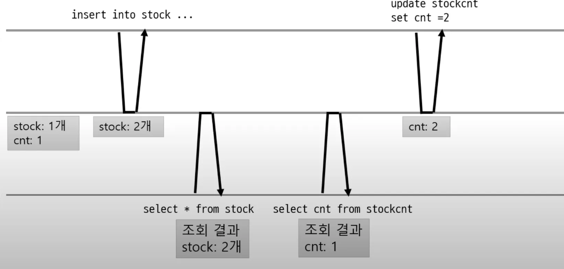
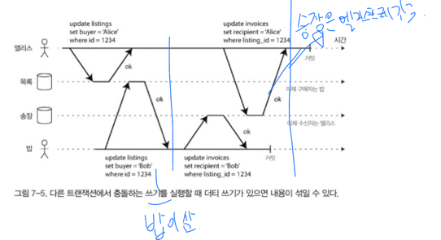
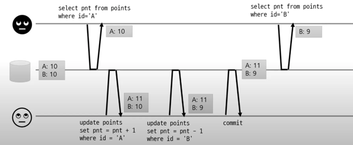
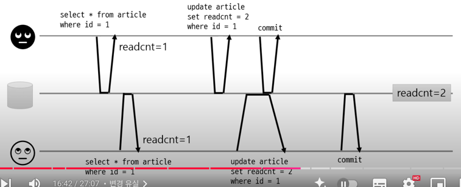
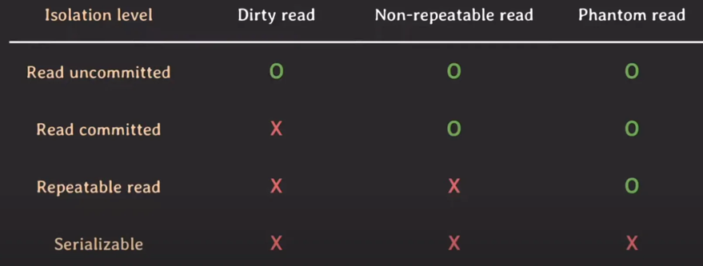

# 트랜잭션 격리 레벨
- 여러 트랜잭션이 진행될 때, 트랜잭션의 결과를 다른 트랜잭션에게 어떻게 노출할 것인지를 결정하는 기준

## dirty read
- 다른 트랜잭션에서 커밋되지 않은 데이터 읽는 것

## dirty write
- 다른 트랜잭션이 커밋되지 않은 데이터 덮어쓰는 것

## read skew
- 읽는 시점마다 데이터 값이 달라짐.
  - 한 트랜잭션 내에서 같은 쿼리를 두 번 수행했는데, 그 사이에 다른 트랜잭션이 값을 수정 또는 삭제함으로써 두 쿼리 결과가 다르게 나타나는 현상을 말함.
  
## phantom read
- 트랜잭션 중에 없던 행이 추가되어 새로 입력된 데이터를 읽는 것.
- 트랜잭션 중에 데이터가 삭제되어 다음 읽기 시 이전에 존재하던 행이 사라지는 것.
## lost update(변경 유실)
- 같은 데이터를 쓸 때 발생
  - 원하는 값은 3인데 2가됨(아래 그림).

### lost update 방지
- db가 지원하는 원자적(atomic) 연산 사용(db가 지원하는지).
- 명시적 잠금(`select.. for update`)
  - 조회할 때 수정할 행을 미리 잠금 -> 다른 트랜잭션이 select도 못함
- CAS
  - 수정할 때, 값이 같은지 비교(version 값 이용)\

## write skew(phantom read 일종)
- 같은 데이터를 쓰지는 않지만 실제로는 경쟁 상태
### ex
- 트랜잭션 1 (의사 A):

    - 현재 당직 상태 조회 → "B가 당직 중" 확인.

    - "B가 있으니 내 휴가 가능" → A의 상태를 "휴가"로 변경.

- 트랜잭션 2 (의사 B):

  - 현재 당직 상태 조회 → "A가 당직 중" 확인.

  - "A가 있으니 내 휴가 가능" → B의 상태를 "휴가"로 변경.

### 원인

- 각 트랜잭션이 동시에 읽은 데이터를 기반으로 결정을 내림.

- 서로 다른 레코드(A/B)를 수정 → DB락으로 방지 불가.

- 비즈니스 규칙이 개별 데이터가 아닌 조합에 의존하기 때문.

## 1. Read Uncommitted
- 가장 낮은 격리 수준
- 각 트랜잭션의 변경 내용이 커밋/롤백 여부에 상관 없이 다른 트랜잭션에서 값을 읽을 수 있음.
- 하나의 트랜잭션이 커밋되기전에 그 변화가 다른 트랜잭션에 그대로 노출되는 문제가 있음.
- 가장 빠르기 때문에, 성능을 극대화 할 때 의도적으로 사용함.

## 2. Read Committed
- 가장 많이 사용되는 격리 수준
- 트랜잭션이 커밋한 정보만 읽을 수 있음.
    - 커밋된 값과 트랙잭션 진행 중인 값을 따로 보관.
    - undo 영역에 백업된 레코드에서 값을 가져옴.
- 커밋된 데이터만 쓰기
    - 행 단위 잠금을 사용한다 → 같은 데이터를 수정한 트랜잭션이 끝날때 까지 대기.
- 하나의 트랜잭션이 읽은 로우를 다른 트랜잭션이 수정할 수 있음.

## 3. Repeatable Read
- 트랜잭션마다 트랜잭션 ID를 부여하여 트랜잭션 ID보다 작은 트랜잭션 번호에서 변경한 것만 읽게 됨.
  - <u>트랜잭션 동안 같은 데이터를 읽게 함. -> MVCC(특정 버전에 해당하는 데이터만 읽음)</u>
- 하나의 트랜잭션이 읽은 로우를 다른 트랜잭션이 `수정하는 것을 막아줌.`
- `새로운 로우를 추가(insert)하는 것은 제한하지 않는다`. 따라서 SELECT로 조건에 맞는 로우를 전부 가져오는 경우 트랜잭션이 끝나기 전에 추가된 로우가 발견될 수 있음.

## 4. SERIALIZABLE
- 가장 강력한 트랜잭션 격리수준. 
  - 트랜잭션을 순차적으로 진행시켜 주기 때문에 여러 트랜잭션이 동시에 같은 테이블의 정보를 액세스하지 못함.
- 가장 안전한 격리수준이지만 가장 성능이 떨어지기 때문에 극단적인 안전한 작업이 필요한 경우가 아니라면 자주 사용되지 않음.

