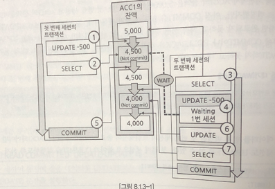

# 트랜잭션
## 트랜잭션이란?
- 쪼개서 실행할 수 없는 작업의 최소 단위.
- 여러 개의 sql로 구성될 수 있음.
### commit과 rollback
- 모든 작업이 한 번에 실행되거나, 아예 실행되지 않아야함(`원자성`).
- rollback시 논리적(업무적)으로 인해 진행해서는 안되는 상황일 수 있음.
  - B계좌가 존재하지 않는 상태에서 B계좌 잔액을 update하는 경우 등등
    - 이 경우 계좌에서 금액을 차감해서는 안 됨.
  - 업무적인 점검 로직을 추가해서 트랜잭션을 rollback함.
```
[트랜잭션 시작]
       │
       ▼
┌───────────────┐
│ A 계좌 -100원   │
└───────────────┘
       │
       ▼
┌───────────────┐
│  B 계좌 +100원  │
└───────────────┘
       │
       ├───────────▶ [성공] → **commit** 💾 (변경사항 저장)
       │
       ▼
[오류 발생?] ────▶ [실패] → **rollback** 🔄 (변경사항 취소)
```
### commit을 잘 못 사용한 예
- 부정확한 데이터가 만들어질 수 있음.
  - rollback을 할 상황에 commit을 수행하는 경우
- <u>sql 문장에서 에러가 발생한다고 해서</u>  <mark>데이터베이스는 전체 트랜잭션을 rollback하지 않음.</mark>
- <mark>반드시 명시적으로  rollback을 실행해야 함.</mark>

### 트랜잭션의 시작과 끝
- 데이터 변경이 sql이 실행되는 순간 시작
- 시작된 트랜잭션은 commit이나 rollback을 만나기 전까지 유지
- commit이나 rollback을 만난 후, 새로운 변경 sql이 실행되면, 그 후에  새로운 트랜잭션이(다른 sql들) 시작됨.

## 트랜잭션 테스트
### 정상적인 계좌 이체
- acc1에는 3000, acc2는 500원
```sql
update m_acc t1
set t1.bal_amt = t1.bal_amt - 500
where t1.acc_no = 'acc1';

update m_acc t1
set t1.bal_amt = t1.bal_amt + 500
where t1.acc_no = 'acc2';

commit;
```

|  acc1 | 1번계좌  | 2500  |
|---|---|---|
| acc2  | 2번계좌  |  1000 |
| acc3  | 3번계좌  |  0 |

### 비정상적인 계좌이체 - 수신 계좌가 없는 경우
- acc1에서만 500원이 사라짐.
- acc4는 계좌가 없음.
```sql
update m_acc t1
set t1.bal_amt = t1.bal_amt - 500
where t1.acc_no = 'acc1';

update m_acc t1
set t1.bal_amt = t1.bal_amt + 500
where t1.acc_no = 'acc4';

rollback;
```

|  acc1 | 1번계좌  | 2500 |
|---|---|------|
| acc2  | 2번계좌  | 1000 |
| acc3  | 3번계좌  | 0    |

### 비정상적인 계좌이체 - 이체 금액이 잔액보다 큰 경우
```sql
update m_acc t1
set t1.bal_amt = t1.bal_amt - 5000
where t1.acc_no = 'acc1';

update m_acc t1
set t1.bal_amt = t1.bal_amt + 5000
where t1.acc_no = 'acc3';

select *
from m_acc;

rollback;
```
- acc1의 잔액이 -2500이 됨.

### 트랜잭션 중에 에러가 발생한 경우
```sql
insert into m_acc(acc_no, acc_nm, bal_amt) values ('acc4','4번계좌',0);
insert into m_acc(acc_no, acc_nm, bal_amt) values ('acc1','1번계좌',0);    
-- ORA-00001: unique constraint (ORA_SQL_TEST. PK_M_ACC) violated 발생

select *
from m_acc;
```
-  unique constraint 오류가 발생했지만, 에러가 발생했다고 해서 틀랜잭션 전체가 자동 rollback 되는 것은 아니기 때문에 'acc4'계좌는 생성됨.


| acc1 | 1번계좌 | 2500 |
|------|------|------|
| acc2 | 2번계좌 | 1000 |
| acc3 | 3번계좌 | 0    |
| acc4 | 4번계좌 |0|

### 정리
- 트랜잭션은 한 번에 이루어져야 하는 작업 단위.
- 트랜잭션은 commit이나 rollback으로 종료가 이루어짐.
- commit으로 종료될 경우, 트랜잭션에서 변경된 데이터들은 모두 db에 반영.
- rollback으로 종료될 경우, 틀랜잭션 시작 이전으로 데이터들은 복구.
- 트랜잭션 내에서 에러가 발생했다고 해서 자동으로 rollback이 수행되지 않음.

## 트랜잭션 고립화 수준
- 하나의 트랜잭션에서 작업 중인 데이터를 다른 트랜잭션이 어느 정도까지 접근할 수 있는지에 대한 정도.
- 비정상적인 데이터를 막기 위해서 트랜잭션 고립화 수준의 이해가 필요.
- 고립화 수준을 낮게 설정하면 동시성이 좋아지고, 높게 설정하면 동시성이 안 좋아짐.
- 데이터의 정확성을 높이기 위해서는 고립화 수준을 높여야 함.
- => 동시성과 정확성 두 가지가 동시에 확보되도록 해야함.
- 오라클은 READ UNCOMMITTED가 없음.

### READ COMMITED: UPDATE-SELECT 테스트
- `commit`된 데이터만 READ할 수 있음.
```sql
-- 첫 번째 세션
select * from M_ACC t1 where t1.ACC_NO = 'acc1';

update M_ACC t1
set t1.BAL_AMT = 5000
where  t1.ACC_NO = 'acc1';

select * from M_ACC t1 where ACC_NO = 'acc1';

-- 두 번째 세션
select * from M_ACC t1 where ACC_NO = 'acc1';
```
- 첫 번째 세션이 commit이 돼야 두 번째 세션이 5000원의 데이터를 읽을 수 있음.

### READ COMMITED: UPDATE-UPDATE 테스트
- <u>첫 번째 세션에서 update를 한 후 commit이나 rollback을 하지 않으면, 두 번재 세션의 update는 계속 실행 중에 빠짐.</u>
- 두 번째 세션은 `wait`상태에 빠짐.
  - 선행 트랜잭션이 데이터를 변경하고 있으므로, 후행 트랜잭션이 데이터네 접근하지 못하고 기다리는 상태를 뜻함.
  - 대기 상태가 길어지면 데이터베이스의 동시성이 나빠짐.
```sql
-- 첫 번째 세션
update M_ACC t1
set t1.BAL_AMT = t1.BAL_AMT - 500
where  t1.ACC_NO = 'acc1';

select * from M_ACC t1 where ACC_NO = 'acc1'; -- 4500

-- 두 번째 세션
select * from M_ACC t1 where ACC_NO = 'acc1'; -- 5000(커밋 전)

update M_ACC t1
set t1.BAL_AMT = t1.BAL_AMT - 500
where  t1.ACC_NO = 'acc1';

```
- 첫 번째 세션에서 500원을 뺏으므로 4500원임(commit 전)
- 첫 번재 세션에서 commit을 하지 않았기 때문에, 조회를 했을 때, 5000원이 나옴
- 첫 번째 세션을 커밋한 후 두 번째 세션을 커밋하면 잔액은 4000원이 됨.
  - 두 번씩 500원 뺌
- 그런데, <u>두 번째 세션에서 보면 5000원에서 500원을 뺏는데, 4000원이 되버림</u>

```
1. 첫 번재 세션에서 update를 실행해, acc1의 잔액을 500원 차감시킴
  - 아직 not commit
2. 첫 번째 세션에서 acc1의 잔액을 select하면 4,500원임
3. 두 번째 세션에서 acc1의 잔액을 select하면 5,000원이 조회
4. 두 번째 세션에서 update를 실행해 acc1의 잔액을 500원 차감시키려 했으나,
  - 두 번째 세션은 `대기 상태`에 빠짐.
  - 첫 번재 세션이 같은 데이터를 변경 commit이나 rollback 하지 않았기 때문
5. 첫 번재 세션에서 commit을 수행
6. 첫 번째 세션이 commit 하자, 두 번째 세션은 대기 중이던 update 문을 바로 처리
7. 두 번째 세션에서 잔액을 조회하면 4,000원이 조회
 - 두 번째 세션의 3번 과정에서 acc1의 잔액은 5,000원 이었음
 - 4번 과정에서 500원만 차감시켰으나, 7번의 결과는 4,000원이 조회됨.
 - 두 번째 세션의 트랜잭션 중간에 첫 번째 세션의 update가 commit 되었기 때문. 
```

### READ COMMITED: INSERT-INSERT 테스트
```sql
-- 첫 번째 세션
insert into m_acc(acc_no, acc_nm, bal_amt) VALUES ('acc4','4번계좌',0);

-- 두 번째 세션
insert into m_acc(acc_no, acc_nm, bal_amt) VALUES ('acc4','4번계좌',0);
```
- 첫 번째 세션에서 commit이나 rollback을 하기 전까지, 두 번째 세션은 <u>대기상태에 빠짐</u>.
  - acc_no가 pk이기 때문에 만약 commit이 된다면 두 번째 세션의 sql은 에러가 남. 
  - 첫 번째 세션의 결과에 따라 결과가 달라짐.

### READ COMMITED: INSERT-INSERT 테스트 2
```sql
-- 첫 번째 세션
insert into m_acc(acc_no, acc_nm, bal_amt) VALUES ('acc5','5번계좌',0);

-- 두 번째 세션
insert into m_acc(acc_no, acc_nm, bal_amt) VALUES ('acc99','99번계좌',0);
insert into m_acc(acc_no, acc_nm, bal_amt) VALUES ('acc5','5번계좌',0);

```
- 첫 번째 세션에서 acc5를 insert한 후에 commit하지 않음.
- 두 번째 세션에서 acc99를 insert했을 경우 <u>대기상태에 빠지지 않음 -> 중복되는 데이터가 아니기 때문</u>
  - acc5 계좌를 insert할 경우 대기상태에 빠짐.
- 첫 번째 세션을 commit을 할 경우, 두 번째 세션의 acc5 insert문은 에러가 발생
  - 하지만, 에러가 발생했다고 자동으로 rollback하지 않기 때문에 acc99 commit시 insert 됨.

### 정리
- 한 트랜잭션이 변경 중 데이터는 다른 트랜잭션에서 변경 전 데이터만 조회 가능
- <mark>한 트랜잭션이 변경 중 데이터는, 다른 트랜잭션에서 동시에 변경할 수 없음.</mark>
  - 늦게 update 시도한 세션은 대기상태에 빠짐(delete)도 마찬가지.
- update가 대기 상태에 빠지면 선행 트랜잭션의 처리에 따라 update 결과가 다름.
- 같은 키 값을 가진 데이터가 동시에 입력되면, 후행 트랜잭션은 대기 상태에 빠짐
  - pk, uk
- 선행 트랜잭션의 처리에 따라 후행 트랜잭션은 중복에러가 발생할 수 있음.
- 에러가 발생해도 자동으로 rollback되지 않음.


