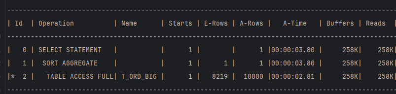
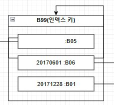
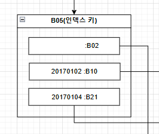
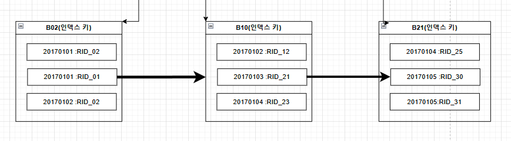

# index
- 테이블 내의 데이터를 찾을 수 있게 일부 데이터를 모아서 구성한 데이터 구조
- 인덱스를 이용하면 테이블 내의 데이터를 빠르게 찾아낼 수 있음.

##  최적의 인덱스를 만들려면..
- 인덱스의 물리적인 구조를 이해해야
- 복잡한 sql을 분해해서 이해할 수 있는 능력
- 만들어진 인덱스가 어떻게 사용될지 예측할 수 있는 능력
- 테이블 내의 데이터 속성을 파악할 수 있는 능력
- join의 내부적인 처리방법(nested, loops, merge, hash)의 이해

### 인덱스 전
- full scan으로 약 4초

### 인덱스 후
- 0.1초로 단축
- buffers 258k -> 24로 단축

## 인덱스 종류
### 단일 인덱스
- 인덱스에 하나의 컬럼만 사용
  - 고객id, 주문번호 등등 단일 컬럼일 경우
### 복합 인덱스
- 인덱스에 두 개 이상의 컬럼을 사용
- 복합 인덱스로 여러 sql을 커버하는 것이 좋음.
    - sql 별로 필요한 인덱스를 모두 만들다 보면 인덱스가 너무 많아짐.

### 유니크 인덱스
- 인덱스 구성 컬럼들 값에 중복을 허용하지 않음.
    - pk 제약 조건 등 업무적으로 유니크한 속성들을 파악해서 유니크 인덱스를 만들어 주는 것이 좋음
### 비유니크 인덱스
- 인덱스 구성 컬럼들 값에 중복을 허용함
  -
### b트리 인덱스
- 트리형 자료구조를 사용
### 비트맴 인덱스
- 값의 종류가 많지 않은 컬럼에서 사용
- 주문 유형의 값이 '주문대기', '주문완료' 두 가지만 있다면 고려 가능.
-  b트리 인덱스가 성능 면에서 유리할 때가 많음.
### IOT(Index Organized Table)
- 테이블 자체를 특정 컬럼 기준으로 인덱스화 하는 개념
- 클러스터드 인덱스와 같은 개념
  - mysql은 pk를 무조건 클러스터드 인덱스로 구성
  - 오라클은 잘 사용안함 
- b트리로 구성

### 파티션
- 대용량 테이블에는 파티션을 구성하는 것이 좋음
- 파티션 없이 인덱스를 만들어 사용하기에는 성능에 한계가 있음
- 오래된 데이터는 별도 저장소로 백업한 후 주기적으로 지우는 것이 비용과 성능에 도움이 된다.
이때, 파티션이 매우 유용
- 파티션 테이블에는 파티션 된 인덱스를 만들 수 있음
  - 글로벌 인덱스
  - 로컬 인덱스

> 분류를 혼합해서 인덱스를 생성 할 수 있다.
> - 복합 인덱스 면서 유니크인 b트리 인덱스
> - 단일 인덱스면서 비트맵 형태 인덱스 등등

## B* 트리
- 균형이 잡혀 있고 근접한 리프 노드가 연결된 구조
- `B` : balanced 의미 -> 리프 노드들이 같은 수준에 자리해 있다는 의미
- `*` : 근접한 리프 노드가 연결된 구조를 의미

## 인덱스 블록
- 루트
  -  최상위에 단 하나만 존재
  - 하위 브랜치 블록의 인덱스 키 값과 주소를 가지고 있음.
- 브랜치
  - 루트와 리프의 중간 위치, 브랜치는 여러 층이 있을 수 있음.
- 리프
  - 최하위에만 위치
  - `인덱스 키 값(인덱스를 구성하는 컬럼)`과 데이터의 로우 위치(ROWID)를 가지고 있음.
  - 리프 블록은 인덱스 키 값 순으로 정렬

### 루트 블록

- `20170104`를 찾아야함
- 세 개의 브랜치 블록(B05, B06, B01)을 찾아갈 수 있음.
- `20170104`는 빈값보다 크고 20170601보다 작음 -> B05로 이동

### 브랜치 블록

- 세 개의 리프블록을 가지고 있음
- `20170104`는 20170102보다 크고  20170104보다 작거나 같으므로 -> `B10으로` 이동
- B21로의 이동은 B10 뒷부분에도 `20170104`가 있을 수 있으므로 가서는 안됨.

### 리프 노드

- B10 마지막 부분에 `20170104`가 있음 <- B21로 이동했다면 rid_23에 있는 데이터는 찾지 못함
- 인덱스를 검색해서 리프 블록에 도달하면 리프 블록을 차례대로 스캔
  - 찾으려는 값보다 큰 값을 발견하기 전까지 수행
  - B10 첫 번째 데이터에서 시작해 B21 블록의 20170105를 만날 때 까지 스캔 진행
- ROWID를 참고해 실제 테이블 접근 작업을 수행