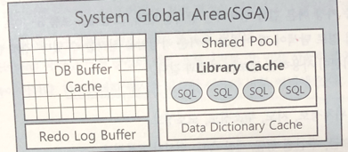
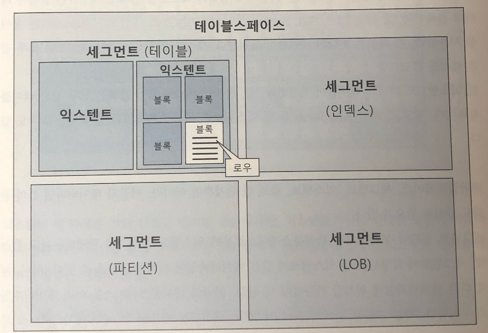
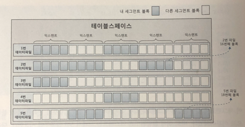

# sql 처리 과정과 i/o
## 1.1 sql 파싱과 최적화
### 1.1.1 구조적, 집합적, 선언적 질의 언어
sql은 기본적으로 구조적, 집합적, 선언적 질의 언어.<br/>
원하는 결과집합을 구조적, 집합적으로 선언하지만 집합을 만드는 과정은 절차적
### 1.1.2 sql 최적화
dbms 내부에서 옵티마이저가 프로시저를 작성하고 컴파일해서 실행가능한 상태로 만드는 과정.
1. sql 파싱
- 사용자로 부터 sql을 전달받으면 파서가 파싱을 진행
  - 파싱 트리 생성 : sql 문을 이루는 개별 구성요소를 분석해서 파싱 트리 생성
  - syntax 체크 : 문법적 오류가 없는지 확인
  - semantic 체크 : 의미상 오류가 없는지 확인
    - 존재하지 않는 테이블이나 컬럼을 사용했는지, 권한이 있는지 등
2. sql 최적화
- 옵티마이저가 미리 수닙한 시스템 및 오브젝트 통계정보를 바탕으로 다양한 실행경로를 생성해서 비교한 후 가장 효율적인 것을 선택
3. 로우 소스 생성
- 옵티마이저가 선택한 실행경로를 실제 실행 가능한 코드나 프로시저 형태로 포맷팅하는 단계
- 로우 소스 생성기(row-source generator)가 수행
### 1.1.3 sql 옵티마이저
사용자가 원하는 작업을 가장 효율적으로 수행할 수 있는 최적의 데이터 액세스 경로를 추천해주는 dbms 핵심 엔진<br/>
서버 프로스세가 가진 기능.
1. 사용자로 부터 전달받은 쿼리를 수행하는데 후보군이 될만한 실행계획들을 찾아냄
2. 데이터 딕셔너리(data dictionary)에 미리 수집해 둔 오브젝트 통계 및 시스템 통계정보를 통해 각 실행계획의 예상비용 산정.
3. 최저 비용을 나타내는 실행계획 선택

### 1.1.4 실행계획과 비용
`실행계획(Execution Plan)`으로 sql 실행경로 미리보기 할 수 있음
- `비용(cost)`은 쿼리를 수행하는 동안 발생할 것으로 <u>예상하는</u> i/o 횟수 또는 예상 소요시간을 표현한 값.
  - 실제와 차이 날 수 있음.
### 1.1.5 옵티마이져 힌트
개발자가 직접 더 효율적인 액세스 경로를 찾아 낼 수 있음<br/>
이때, 옵티마이저 힌트를 통해 데이터 액세스 경로를 바꿀 수 있음.
```oraclesqlplus
select /*+ index(A pk)*/ --이렇게 사용
고객명, 주소
from 고객 A
where 고객id = '000001';
```
#### 주의 사항
힌트 안에 인자를 나열할 땐, ','를 사용할 수 있지만, 힌트와 힌트 사이에 사용하면 안됨.
```oraclesqlplus
/*+ index(A A_pk) index(B, B_pk)*/
/*+ index(A A_pk), full(B)*/ -- 이건 안됨.
```
테이블을 지정할 때 스키마 명까지 명시하면 안됨
```oraclesqlplus
/*+ index(SCOOTT.A A_pk) */
```
from 절에 alias를 지정했다면 힌트에도 반드시 alias를 지정해야 함.
```oraclesqlplus
select /*+ full(emp)*/ -- 무시함.
from emp A;
```

> 힌트를 사용할 거라면 옵티마이저가 절대로 다른 방식을 선택하지 못하도록 빈틈없이 기술해야함.

## 1.2 sql 공유 및 재사용
### 1.2.1 소프트 파싱 vs 하드 파싱
- 라이브러리 캐시(library cache) : sql 파싱, 최적화, 로우 소스 생성 과정을 거쳐 생성한 내부 프로시저를 반복 재사용할 수 있도록 캐싱해두는 메모리 공간
- SGA(system global area) : 서버 프로세스와 백그라운드 프로세스가 공통으로 액세스하는 데이터와 제어구조를 캐싱하는 메모리 공간

- `소프트 파싱` : sql을 캐시에허 찾아 곧바로 실행 단계로 넘어가는 것을 말함.
- `하드 파싱` : 캐시에서 찾는데 실패해 최적화 및 로우 소스 생성 단계까지 모두 거치는 것

#### sql 최적화 과정이 hard한 이유
- 옵티마이저가 sql을 최적화 할 때, 많은 일을 수행
  - 테이블 컬럼, 인덱스 구조에 관한 기본 정보
  - 오브젝트 통계 : 테이블 통계, 인덱스 통계, 컬럼 통계
  - 시스템 통계 : cpu 속도, 싱글 블록 io 속도, 멀티 블록 io 속도
  - 옵티마이저 관련 파라미터
- 하드 파싱은 cpu를 많이 소비하는 몇 안되는 작업 중 하나.
- 그래서 라이브러리 캐시가 필요함.

### 1.2.2 바인드 변수의 중요성
#### 이름 없는 sql 문제
- sql은 이름이 따로 없고 전체 sql 텍스트가 이름 역할을 함
- 딕셔너리에 저장하지도 않음
- 라이브러리 캐시에 적재함으로 써, 여러 사용자가 공유
- 캐시 공간이 부족하면 버려졌다가 다음에 다시 실행할 때 똑같은 최적화 과정을 거쳐 캐시에 적재
=> sql 자체가 이름이기 때문에 텍스트 중 작은 부분이라도 수정되면 그 순간 다른 객체가 탄생하는 구조
#### 공유 가능 sql
의미적으로는 같지만, 실행할 때 각각의 최적화를 진행하고 라이브러리 캐시에 별도 공간 사용
```oraclesqlplus
select * from emp where empno = 7900;
SELECT * FROM EMP WHERE EMPNO = 7900;
SELECT * FROM EMP WHERE EMPNO = 7900 ;
SELECT * FROM EMP WHERE EMPNO = 7900    ;

```
```java
"select * from customer where login_id = """+login_id+""";
```
- 이 sql은 모든 sql을 하드파싱하고 캐시에 적재하기 때문에 io 대비 cpu 사용량을 증가 시킴.

##### 바인드 변수 사용
```java
import java.sql.PreparedStatement;

String sql = "select * from customer where login_id = ?";
PreparedStatement st = con.preparedStatement(sql);
con.setString(1,login_id);

```
- 이 경우에 하드 파싱은 최초로 한 번만 일어나고, 재사용됨.

## 1.3 데이터 저장 구조 및 io 메커니즘
io 튜닝 = sql 튜닝
### 1.3.1 sql이 느린 이유
디스크 io때문
- `io = sleep` : os나 io 서브시스템이 io를 처리하는 동안 프로세스는 잠을 잠.
  - 프로세스는 디스크에서 데이터를 읽어야할 때 cpu를 os에 반납하고 대기 상태(waiting)에서 io가 완료되기를 기다림.
    - io call을 한 후 cpu를 반환하고 대기 큐에서 대기를 함.
- io call 속도 single block io 기준 10ms -> 10,000 블록을 읽는다면 10초 이상 기다려야함.

### 1.3.2 데이터베이스 저장 구조

#### 테이블 스페이스
- 데이터를 저장하려면 `테이블 스페이스`를 생성해야함.
- 세그먼트를 담는 콘테이너, 여러 개의 데이터파일(디스크 상의 물리적인 os 파일)로 구성

#### 세그먼트
- `세그먼트`는 테이블, 인덱스처럼 데이터 저장공간이 필요한 오브젝트
- 테이블, 인덱스를 생성할 때 데이터를 어떤 테이블스페이스에 저장할지를 지정
- 여러 익스텐트로 구성됨.
- 테이블도 하나의 세그먼트이고, 인덱스도 하나의 세그먼트, 파티션 구조라면, 각 파티션이 하나의 세그먼트, lob 컬럼은 그 자체가 하나의 세그먼트를 구성
#### 익스텐트
- 공간을 확장하는 단위
- 테이블이나 인덱스에 데이터를 입력하다가 공간이 부족해지면 해당 오브젝트가 속한 테이블스페이스로부터 익스텐트를 추가로 할당받음.
- 연속된 블록의 집합이기도 함.
- 한 익스텐트도 하나의 테이블이 독점

#### 블록(block, page)
- 사용자가 입력한 레코드를 실제로 저장하는 공간은 데이터 블록
- 한 블록은 하나의 테이블이 독점.
  - 한 블록에 저장된 레코드는 모두 같은 테이블의 레코드 (단,다중 테이블 클러스터 제외)
- 한 익스텐트도 하나의 테이블이 독점하기 때문에 한 익스텐트에 담긴 블록은 모두 같은 테이블의 블록

> 세그먼트에 할당된 모든 익스텐트가 같은 데이터파일에 위치하지 않을 수 있음
> 서로 다른 데이터파일에 위치할 가능성이 더 높음.
> 파일 경함을 줄이기위해 데이터를 가능한 여러 데이터파일로 분산에서 저장함.

- 세그먼트에 할당된 익스텐트 목록 조회
```oraclesqlplus
select segment_type, tablesapce_name, extent_id, file_id, block_id, blocks
from "PUBLIC".DBA_EXTENTS
where owner = user
and SEGMENT_NAME = 'my-segment'
order by extent_id;
```

> - DBA(Data Block Address)
> 데이터블록이 디스크 상에서 몇 번 데이터파일의 몇 번째 블록인지를 나타내는 자신만의 고유 주소값
> 데이터를 읽고 쓰는 단위가 블록이므로 데이터를 읽으려면 먼저 DBA부터 확인해야 함.
> - ROWID
> 인덱스를 이용해 데이클 레코드를 읽을 때 이용
> DBA + 로우 번호(블록 내 순번)으로 구성
>
> 테이블을 스캔할 때는 테이블 세그먼트 헤더에 저장된 익스텐트 맵을 이용
> 각 익스텐트의 첫 번째 블록 DBA를 알 수 있음
> 익스텐트는 연속된 블록 집합이므로 테이블을 스캔할 때는 첫 번재 블록 뒤에 연속해서 저장된 블록을 읽으면 됨.

```
테이블 스페이스 1---------- n 세그먼트 1----------- n 익스텐트 1 -------- n 블록
    | 1                     |n                    | n
    |----------------- n 데이터파일 ----------------- 1

```

### 1.3.3 블록 단위 io
데이터 io 단위가 블록이므로 특정 레코드 하나를 읽고 싶어도 해당 클록을 통째로 가져와야함.
```oraclesqlplus
-- 블록 사이즈 확인
show parameter block_size

--  뷰로 직접 조회
select value from v$parameter where name = 'db_block_size';
```

### 1.3.4 시퀀셜 액세스 vs 랜덤 액세스
테이블이나 인덱스 블록을 액세스하는 방식
#### 시퀀셜 액세스
- 논리적 또는 물리적으로 연결된 순서에 따라 차례대로 블록을 읽는 방식
**인덱스에서 시퀀셜 액세스**
  - 인덱스 리프 블록은 앞뒤를 가리키는 주소값을 통해 논리적으로 연결돼 있음
  - 이 주소값에 따라 앞 또는 뒤로 순차적으로 스캔함.
**테이블에서 시퀀셜 액세스**
- 세그먼트에 할당된 익스텐트 목록을 세그먼트 헤더에 맵을 관리
  - 익스텐트 맵은 각 익스텐트의 첫 번째 블록 주소 값을 갖음.
  - 읽어야할 익스텐트 목록을 맵에서 얻고, 각 익스텐트의 첫 번째 블록 뒤에 연속해서 저장된 블록을 순서대로 읽음
  => `Full Table Scan`

#### 랜덤 액세스
- 물리적, 물리적인 순서를 따르지 않고, 레코드 하나를 읽기 위해 한 블록씩 접근하는 방식

### 1.3.5 논리적 io vs 물리적 io
#### db 버퍼캐시
- SGA에 db 버퍼캐시에서 데이터를 캐싱함.
- 같은 블록에 대한 반복적인 io call을 줄이는데 목적
- 서버 프로세스와 데이터파일 사이에 버퍼캐시가 있으므로 데이터 블록을 읽을 땐 항상 버퍼캐시부터 탐색
- 공유메모리 영역이므로 같은 블록을 읽는 다른 프로세스도 득을 볼 수 있음.

```oraclesqlplus
-- db 버퍼캐시 확인.
show sga
```

#### 논리적 io
- sql문을 처리하는 과정에 메모리 버퍼캐시에서 발생한 총 블록io를 말함.
- 전기적인 신호
#### 물리적 io
디스크에서 발생한 총 블록 io를 말함.
- sql 처리 도중 읽어야할 블록을 버퍼캐시에서 찾지 못할 때만 디스크를 액세스하므로 논리적 블록 io 중 일부를 물리적 io함.
- 액세스 arm을 통해 물리적 작용이 일어나므로 느림.


